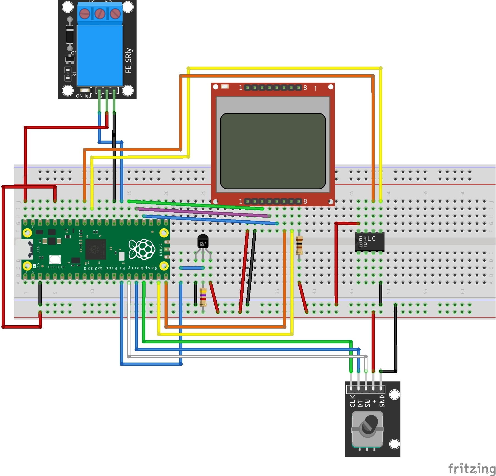

# Termostado com RP2040

## Introdução

Este projeto implementa um termostato simples que utiliza um sensor de temperatura DS18B20 para controlar o acionamento de um relê. 

Uma interface simples com o operador, baseada em um display alfanumérico e botões permite verificar a temperatura atual e configurar as temperaturas de acionamento e desacionamento do relê.

**NÃO É UMA APLICAÇÃO PARA USO REAL!**

## Materiais e Recursos

O projeto utiliza os seguintes componentes:

* Placa Raspberry Pi Pico com o microcontrolador RP2040
* Até 3 sensores DS18B20
* Display Nokia 5110
* 3 botões de contato momentâneo
* Módulo Relê 5 V*  

O software foi escrito em C++ utilizando os recursos do SDK C/C++ da Raspberry Pi Pico. 

## Esquema Elétrico

## Arquitetura do Software

A programação é bem direta, por brevidade não foram incluídas sofisticações nem os recursos de segurança presentes em produtos reais. Em vários pontos é utilizado um estilo mais "clássico" de programação C (ponteiros, defines). 

O código está dividido nos seguintes módulos:

* picotermostato.cpp: módulo principal, contém a lógica do termostato (rodando no core 1) e da interface com o operador (rodando no core 0).
* display.cpp: driver simples para o display (adaptado do exemplo do livro "Knowing the RP2040".
* sensor.cpp: lógica de enumeração e leitura dos sensores.
* teclado.cpp: lógica de leitura e debounce das teclas.

Para comunicação com os sensores foi usado um fork da biblioteca pico-onewire de Adam Boardman (https://github.com/adamboardman/pico-onewire). O meu fork (https://github.com/dquadros/pico-onewire/tree/search-fix) otimiza a operação de busca por dispositivos. 

## Funcionamento

Na iniciação são procurados sensores DS18B20 na rede Onewire, a temperatura utilizada será a média dos até três primeiros sensores encontrados.

O relê é acionado quando a temperatura está menor que a temperatura "Liga" e desligado quando a temperatura é maior que a temperatura "Desliga".

Por simplificação as temperaturas são apresentadas sem parte decimal.

Apertando o botão "Enter", é ativado o modo de configuração e seleciada a temperatura "Liga". As duas outras teclas permitem incrementar e decrementar a temperatura selcionada. Pressionando "Enter" com "Liga" selecionada a seleção passa para "Desliga". Pressionando "Enter" com "Desliga" selecionada sai do modo configuração. A temperatura "Liga" tem que ser menor que a "Desliga". A seleção da temperatura é indicada colocando a legenda em maiúscula.

## Ideias para uma Segunda Versão

* Montagem em um placa de circuito impresso padrão
* Troca dos três botões por um *rotary encoder*, usando uma adaptação do [driver da Pimori](https://github.com/pimoroni/pimoroni-pico/tree/main/drivers/encoder) que utiliza a PIO
* Inclusão de uma EEPrim I2C para salvar as configurações
* Aperfeiçoar a apresentação no display

## Conclusão

Este projeto é bastante simplista na implementação e no acabamento, mas demonstra:

* O uso de entradas e saídas digitais
* O uso de SPI com DMA e interrupção (display)
* O uso dos dois cores ARM do RP2040

## Referências

1. [Knowing the RP2040, Daniel G. A. Quadros](https://leanpub.com/rp2040)
2. [Datasheet do sensor DS18B20](https://datasheets.maximintegrated.com/en/ds/DS18B20.pdf) 

## Licença do projeto

O código do projeto é licenciado sob a licença "MIT", ver o arquivo LICENSE para maiores informações.

